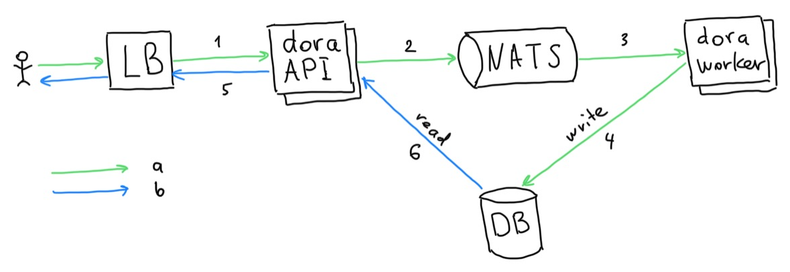

# dora - bmc discovery asset database [](https://goreportcard.com/report/github.com/bmc-toolbox/dora)

A tool to build a dynamic database of your datacenter assets

## How to run

Small installations / Dev Setup:

### Docker

```console
git clone github.com/bmc-toolbox/dora
cd dora
# build docker image with application
docker-compose build dora
# start server in background, accessable by address http://localhost:8000
docker-compose up -d server
# run dora commands
docker-compose run dora scan 192.168.0.0/24
docker-compose run dora collect
```

### Outside of Docker

```console
git clone github.com/bmc-toolbox/dora
cd dora
go build -tags="gingonic" -ldflags="-s -w"
# start server, accessable by address http://localhost:8000
./dora --config dora-simple.yaml server
# run dora commands
./dora scan 192.168.0.0/24
./dora collect
```

Kea example configuration file to load subnets can be found by name
 [kea-simple.conf](kea-simple.conf).

## Requirements

Database - any compatible with [GORM](http://gorm.io/)

## Overview

Dora is a service which gather data about database assets from BMCs
 via HTTP\SSH and give ability to retrieve that data via REST API.

List of supported assets can be found in [the bmclib readme](https://github.com/bmc-toolbox/bmclib#data-collection-support)

### Architecture



"a" is the flow of adding/updating data
"b" is the flow of getting data

"1" is a request to scan or collect assets
"5" is a request to obtain assets

#### Server

Dora web server provides API for querying the data which Dora collected.

#### Worker

Worker consumes jobs issued by `publish` command, perform them and write results to database.

There are two type of jobs:

* `collect`: collects hosts found by the scanner or collect a given list of hosts
 (fast operation, except for Dell servers)
* `scan`: scan networks found in kea config or a list of given networks (slow operation)

In case you run these jobs as commands to dora, it works as a worker who received
the command.

#### Overview
The process of finding assets
1. User sends a request to find (scan) assets in subnets, either in a specific subnet or all (1 on the picture)
1. The list of subnets is loaded from the KEA config file. This list is used as a filter for the subnets specified by the user
1. Every subnet is sent into NATS with the subject `dora::scan` (2 on the picture)
1. Worker subscribed to data with this subject receives a subnet (3 on the picture)
1. Worker checks open ports for every IP address from the subnet and saves the result to the DB (4 on the picture)

The process of collecting assets
1. User sends a request to collect information about assets, either for specific or all assets (1 on the picture)
1. The list of IP addresses which have open port 443 selected from the DB
1. Every IP address is sent into NATS with the subject `dora::collect` (2 on the picture)
1. Worker subscribed to this subject receives an IP address (3 on the picture)
1. Worker connects to every IP address and collects data from BMC
1. Worker saves the result to the DB (4 on the picture)

## Acknowledgment

dora was originally developed for [Booking.com](http://www.booking.com).
With approval from [Booking.com](http://www.booking.com), the code and
specification were generalized and published as Open Source on GitHub, for
which the authors would like to express their gratitude.
